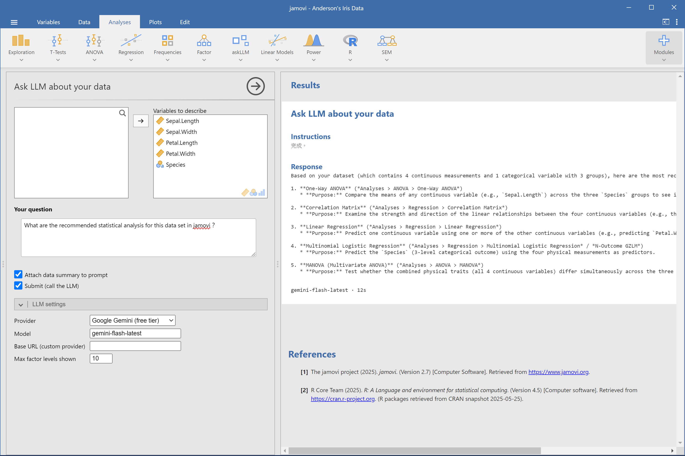
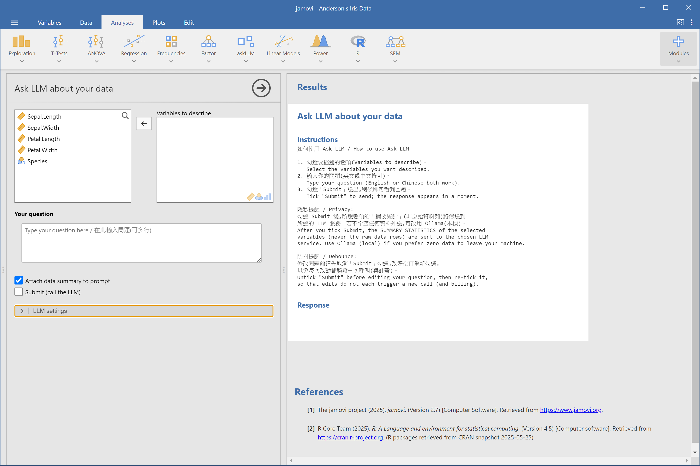
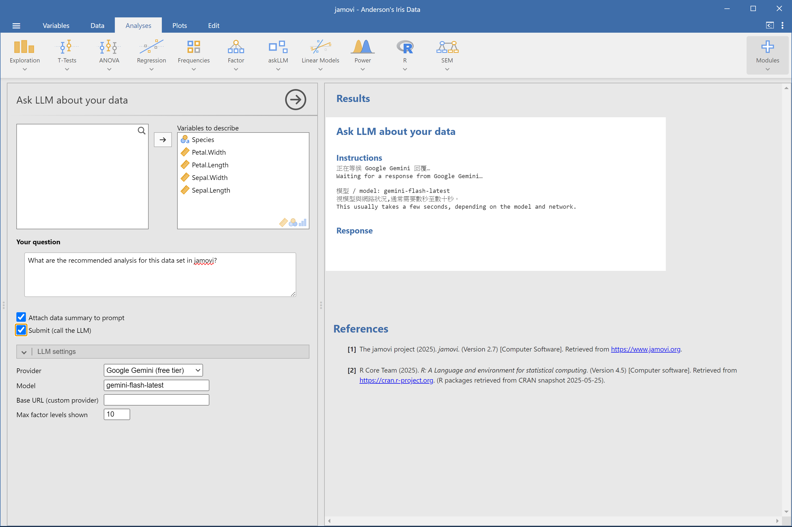
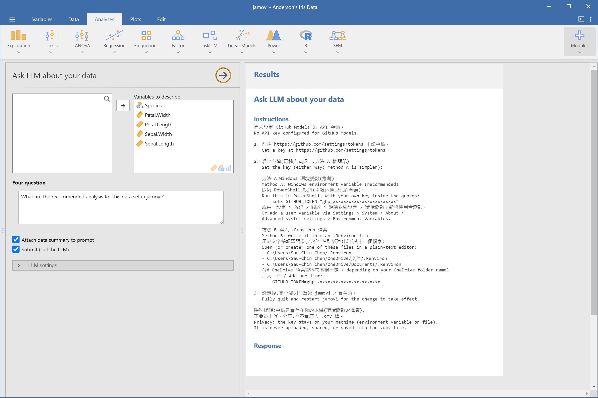

# askLLM

**Ask an LLM about *your* data — right inside jamovi.**

Select the variables you care about, type a question in plain English (or Chinese), and askLLM sends a summary of those variables to an LLM of your choice, which answers with your dataset in mind — including concrete jamovi menu paths for the analysis it suggests. v1.1 scans your installed jamovi modules and attaches the real menu tree to the LLM, ensuring that suggested paths reference only what actually exists on your machine (tested: 18/18 verbatim hits).

[中文版 README](README.zh-TW.md)

## Screenshots



<details>
<summary>More screens</summary>

**Guidance and privacy notice when the analysis opens**



**Waiting state after you submit**



**Key setup instructions when no API key is configured (bilingual)**



</details>

## Installation

### A. From the jamovi library (once published)

Open jamovi, click the `⊕` icon (top right) → **jamovi library** → search for "askLLM" → **Install**.

### B. Side-load the `.jmo` file

If askLLM isn't in the library yet, or you have a locally built `.jmo`:

1. In jamovi, click the `⊕` icon (top right).
2. Go to the **Side-load** tab.
3. Choose the `.jmo` file (see [`dist/`](dist/) in this repo).
4. Wait for installation to finish.

Note: a `.jmo` file is built for a specific **OS × CPU architecture × jamovi series** combination (see the filename, e.g. `askLLM_1.1.0_win64_jamovi-2.7.jmo`). It will only install on a matching jamovi. See [`dist/README.md`](dist/README.md) for details.

## Quick start

1. Open a dataset in jamovi, then run **askLLM** from the analysis menu.
2. Tick the **Variables to describe** you want the LLM to know about, and type your **question**.
3. Tick **Submit** to send. The answer appears in a few seconds, along with the model name and elapsed time.

Untick **Submit** before editing your question, then re-tick it — this avoids triggering a new (billable) call on every keystroke.

**Include installed modules** (enabled by default) automatically scans your jamovi modules and feeds them to the LLM, so path suggestions accurately match your installed analyses. Untick this option to revert to v1.0 behavior.

## Supported providers

| Provider | Free tier / no card | Runs where | Setup guide |
|---|---|---|---|
| NVIDIA NIM | Yes, no card | Cloud | [SETUP-nim.en.md](docs/SETUP-nim.en.md) |
| Google Gemini | Yes, no card | Cloud | [SETUP-gemini.en.md](docs/SETUP-gemini.en.md) |
| GitHub Models | Yes (GitHub account) | Cloud | [SETUP-github.en.md](docs/SETUP-github.en.md) |
| Ollama (local) | Yes, no key at all | Your machine | [SETUP-ollama.en.md](docs/SETUP-ollama.en.md) |
| Custom (OpenAI-compatible) | Depends on the endpoint | Your choice | [SETUP-custom.en.md](docs/SETUP-custom.en.md) |

A GitHub account alone unlocks **35 free models** (OpenAI, Meta Llama, Microsoft Phi, Mistral, DeepSeek, Cohere) — see **[GitHub Models catalog](docs/MODELS-github.en.md)** for the full list, free-tier quotas, and picking advice.

To compare how different models answer the same question about the same data, use [`tools/compare-models.R`](tools/compare-models.R): it runs several models in a row and writes a side-by-side report on accuracy and completeness.

## Limitations

**LLMs produce confident-sounding content that is wrong.** In v1.0 testing, every model got jamovi **menu paths** wrong at least once — including menus that do not exist in jamovi at all. v1.1 has substantially mitigated this problem via module directory scanning (tested: 100% hit rate, 18/18 with zero fabrication). Statistical suggestions remain broadly sensible, but other limitations (applicability of suggestions, numerical verification) still require your own judgment.

Full test notes and teaching suggestions: **[Limitations and usage advice](docs/LIMITATIONS.en.md)**.

## Privacy

- What is sent to the LLM is **summary statistics of the variables you selected** (counts, means, SDs, factor level frequencies, etc.) — **never the raw data rows**.
- API keys are read from your local environment variables or a local `.Renviron` file. They are **never written into the `.omv` file** and are not visible anywhere in the jamovi UI.
- **The names and menu lists of your installed modules** (environmental metadata, no data values) are sent along with the summary to help the LLM ensure suggestions reference only real paths. You can disable this with the "Include installed modules" option.
- If you need **zero data to leave your machine**, choose the **Ollama (local)** provider — everything, including the LLM itself, runs on your own computer.

## For developers

Build from source and install into a specific jamovi installation:

```r
jmvtools::install(home = "C:/Program Files/jamovi 2.7.37.0")
```

Run the test suite (pure-function unit tests, run under a regular system R — not the jamovi-bundled R):

```r
devtools::test()
```

## License

GPL-3 (see [`DESCRIPTION`](DESCRIPTION)).

## Acknowledgements

- [ellmer](https://ellmer.tidyverse.org/) — the R package used to talk to LLM providers.
- [jamovi](https://www.jamovi.org/) — the statistical platform this module runs on.
- [jmvtools](https://github.com/jamovi/jmvtools) — the toolkit used to build and package this module.
