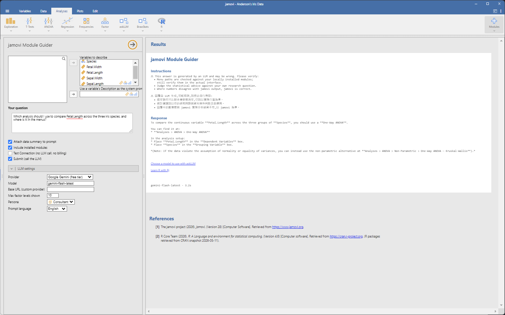
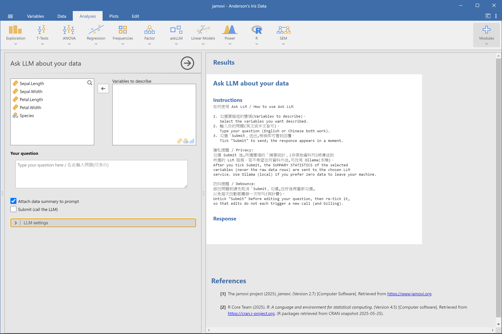
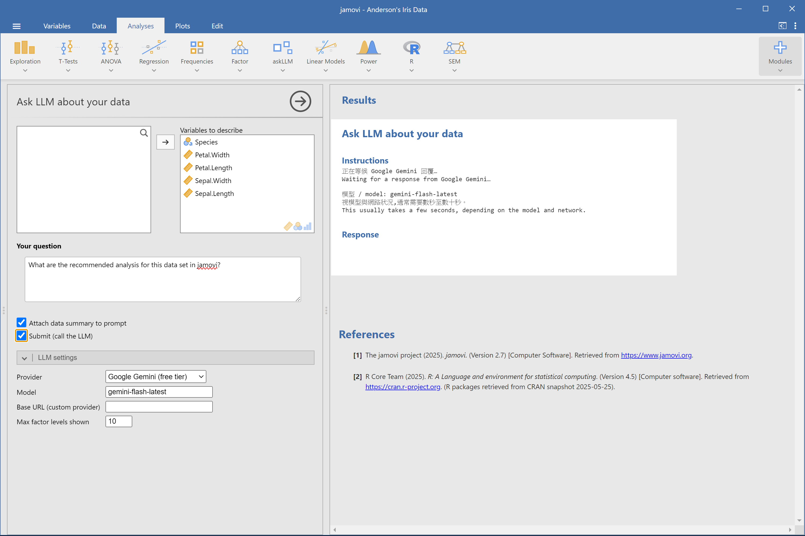
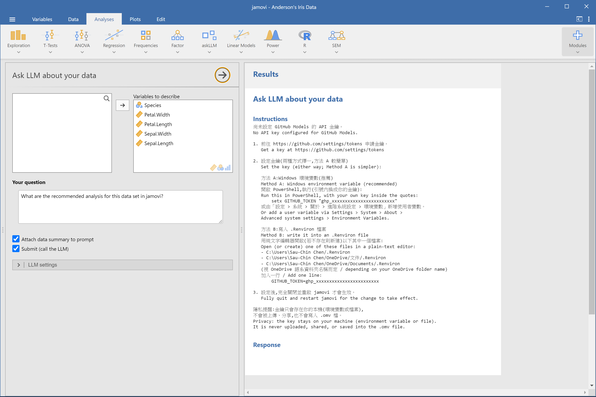

# askLLM

**Ask an LLM about *your* data — right inside jamovi.**

Select the variables you care about, type a question in plain English (or Chinese), and askLLM sends a summary of those variables to an LLM of your choice, which answers with your dataset in mind — including concrete jamovi menu paths for the analysis it suggests. v1.1 scans your installed jamovi modules and attaches the real menu tree to the LLM, ensuring that suggested paths reference only what actually exists on your machine (tested: 18/18 verbatim hits).

[中文版 README](README.zh-TW.md)

## Screenshots



<details>
<summary>More screens</summary>

**Guidance and privacy notice when the analysis opens**



**Waiting state after you submit**



**Key setup instructions when no API key is configured (bilingual)**



</details>

## Installation

### A. From the jamovi library (once published)

Open jamovi, click the `⊕` icon (top right) → **jamovi library** → search for "askLLM" → **Install**.

### B. Side-load the `.jmo` file

If askLLM isn't in the library yet, or you have a locally built `.jmo`:

1. In jamovi, click the `⊕` icon (top right).
2. Go to the **Side-load** tab.
3. Choose the `.jmo` file (see [`dist/`](dist/) in this repo).
4. Wait for installation to finish.

Note: a `.jmo` file is built for a specific **OS × CPU architecture × jamovi series** combination (see the filename, e.g. `askLLM_1.1.0_win64_jamovi-2.7.jmo`). It will only install on a matching jamovi. See [`dist/README.md`](dist/README.md) for details.

## Quick start

1. Open a dataset in jamovi, then run **askLLM** from the analysis menu.
2. Tick the **Variables to describe** you want the LLM to know about, and type your **question**.
3. Tick **Submit** to send. The answer appears in a few seconds, along with the model name and elapsed time.

Untick **Submit** before editing your question, then re-tick it — this avoids triggering a new (billable) call on every keystroke.

**Include installed modules** (enabled by default) automatically scans your jamovi modules and feeds them to the LLM, so path suggestions accurately match your installed analyses. Untick this option to revert to v1.0 behavior.

**Use a variable's Description as the system prompt** (under "LLM settings") lets you drive the persona from your dataset instead of typing it in the module: fill in a variable's **Description** in jamovi's variable Setup panel (e.g. a persona or task instruction), pick that variable here, and its Description is used as the system prompt. Priority order: this variable's Description (if selected and non-empty) > the **Custom system prompt** text box > the Persona template. This is handy for codebooks that already document per-variable context you want the LLM to use.

## Supported providers

| Provider | Free tier / no card | Runs where | Setup guide |
|---|---|---|---|
| NVIDIA NIM | Yes, no card | Cloud | [SETUP-nim.en.md](docs/SETUP-nim.en.md) |
| Google Gemini | Yes, no card | Cloud | [SETUP-gemini.en.md](docs/SETUP-gemini.en.md) |
| OpenRouter | Yes, no card (`:free` models) | Cloud | [SETUP-openrouter.en.md](docs/SETUP-openrouter.en.md) |
| GitHub Models | Yes (GitHub account) | Cloud | [SETUP-github.en.md](docs/SETUP-github.en.md) |
| Ollama (local) | Yes, no key at all | Your machine | [SETUP-ollama.en.md](docs/SETUP-ollama.en.md) |
| Custom (OpenAI-compatible) | Depends on the endpoint | Your choice | [SETUP-custom.en.md](docs/SETUP-custom.en.md) |

A GitHub account alone unlocks **35 free models** (OpenAI, Meta Llama, Microsoft Phi, Mistral, DeepSeek, Cohere) — see **[GitHub Models catalog](docs/MODELS-github.en.md)** for the full list, free-tier quotas, and picking advice.

To compare how different models answer the same question about the same data, use [`tools/compare-models.R`](tools/compare-models.R): it runs several models in a row and writes a side-by-side report on accuracy and completeness.

## Limitations

**LLMs produce confident-sounding content that is wrong.** In v1.0 testing, every model got jamovi **menu paths** wrong at least once — including menus that do not exist in jamovi at all. v1.1 has substantially mitigated this problem via module directory scanning (tested: 100% hit rate, 18/18 with zero fabrication). Statistical suggestions remain broadly sensible, but other limitations (applicability of suggestions, numerical verification) still require your own judgment.

Full test notes and teaching suggestions: **[Limitations and usage advice](docs/LIMITATIONS.en.md)**.

## Privacy

- What is sent to the LLM is **summary statistics of the variables you selected** (counts, means, SDs, factor level frequencies, etc.) — **never the raw data rows**.
- API keys are read from your local environment variables or a local `.Renviron` file. They are **never written into the `.omv` file** and are not visible anywhere in the jamovi UI.
- **The names and menu lists of your installed modules** (environmental metadata, no data values) are sent along with the summary to help the LLM ensure suggestions reference only real paths. You can disable this with the "Include installed modules" option.
- If you need **zero data to leave your machine**, choose the **Ollama (local)** provider — everything, including the LLM itself, runs on your own computer.

## Privacy by design vs. agentic AI

JASP 0.98 (released 2026-07-02) introduced "Fully Integrated AI," which uses an agentic architecture: it sends complete analysis results and outputs to the LLM for processing. askLLM uses a different information architecture — a consultation model that **sends only summary statistics, never the raw data rows**. The two designs carry fundamentally different privacy implications when handling sensitive data.

### askLLM vs. JASP 0.98 AI comparison

| Aspect | askLLM | JASP 0.98 agentic AI |
|---|---|---|
| **What is sent to the LLM** | Summary statistics of selected variables (counts, means, SDs, factor frequencies, etc.) | Complete analysis results and outputs (all details) |
| **Local execution option** | Ollama: fully local, zero transmission; other providers send to cloud | Within JASP only; no fully local option |
| **Suitable for sensitive data** | ✓ Yes (especially with Ollama local execution) | ⚠ Requires caution |

### Why sensitive data needs special attention

**JASP's own team has publicly warned**: many free LLM services — including free tiers of commercial models — may use user inputs for model training or other improvement purposes. This poses a risk for **patient data, proprietary business information, personal sensitive information**[^jasp-privacy-warning].

- If you use an agentic AI architecture with cloud services, the LLM sees **the complete analysis results and statistical output** — information that often contains enough detail to identify individuals or business insights.
- askLLM's design is different: even when using cloud services, the LLM sees only **summary statistics** (e.g., "mean, standard deviation, sample size") — enough to suggest analyses, but not enough to reconstruct individual observations. Combined with Ollama, you can **remain entirely offline** — your LLM and your data both run on your own machine.

### Recommendations

- **Sensitive data: prioritize Ollama (local)**: no API key needed, zero data transmission.
- **If you must use cloud services**: askLLM's "summary statistics only" architecture naturally reduces risk, but we recommend testing with non-sensitive data first, then moving to sensitive scenarios only after you are confident.
- **High-stakes sensitive applications (patient data, trade secrets, etc.)**: consult your organization's data protection or privacy team to confirm your policies allow it.

---

[^jasp-privacy-warning]: JASP Services BV. (2026). [Set up a Fully Integrated AI in JASP, and Run it for Freeeee](https://www.jasp-services.com/set-up-a-fully-integrated-ai-in-jasp-and-run-it-for-freeeee/); JASP team. (2026). [Free API Key Hunting](https://jasp-stats.org/2026/07/09/free-api-key-hunting/)

## For developers

Build from source and install into a specific jamovi installation:

```r
jmvtools::install(home = "C:/Program Files/jamovi 2.7.37.0")
```

Run the test suite (pure-function unit tests, run under a regular system R — not the jamovi-bundled R):

```r
devtools::test()
```

## License

GPL-3 (see [`DESCRIPTION`](DESCRIPTION)).

## Acknowledgements

- [ellmer](https://ellmer.tidyverse.org/) — the R package used to talk to LLM providers.
- [jamovi](https://www.jamovi.org/) — the statistical platform this module runs on.
- [jmvtools](https://github.com/jamovi/jmvtools) — the toolkit used to build and package this module.
