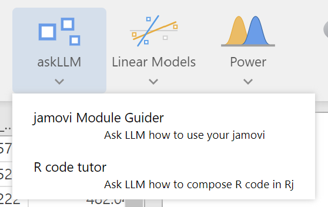
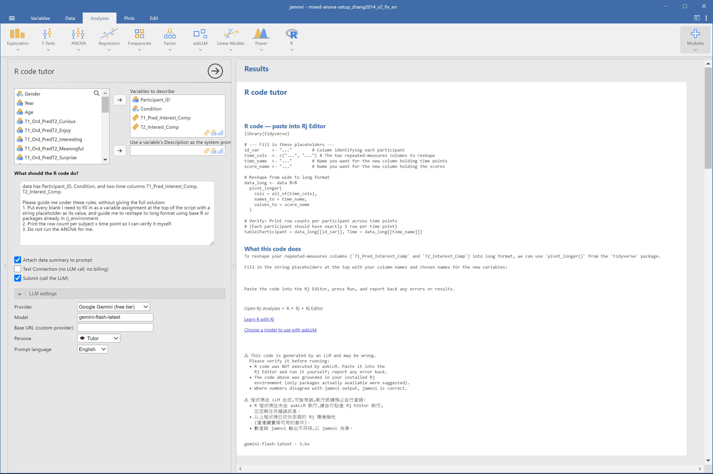
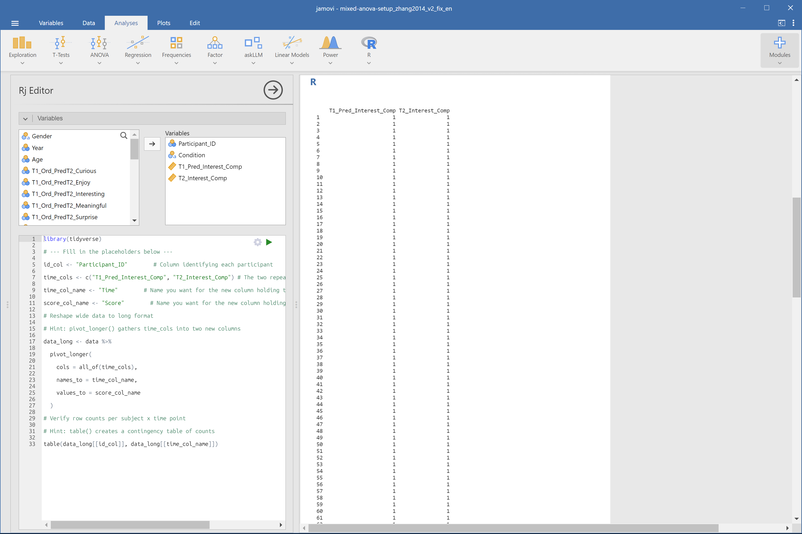
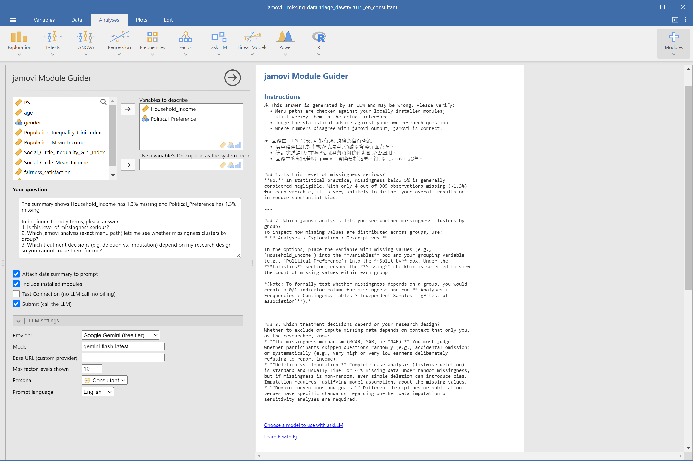
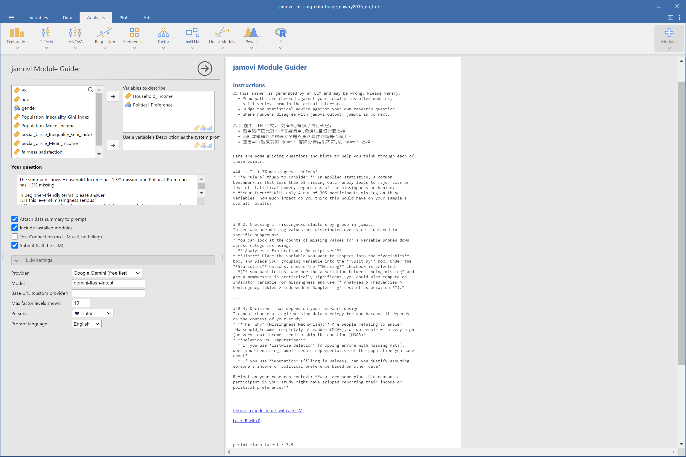
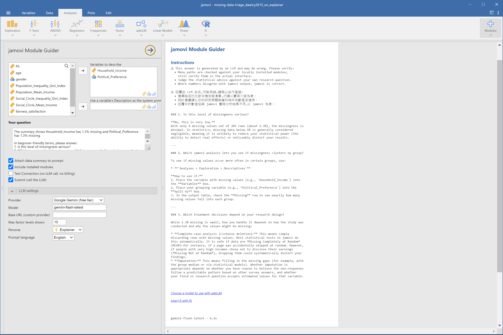
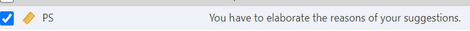
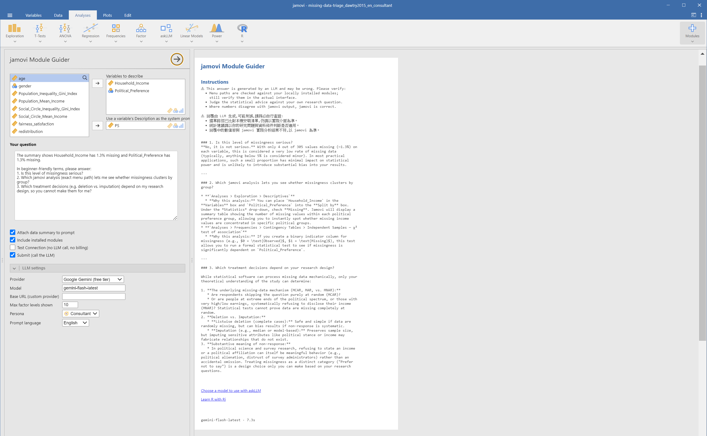
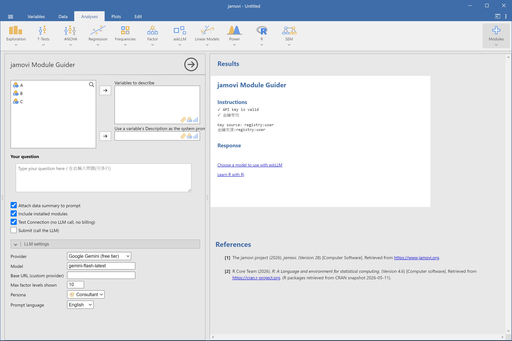

# askLLM

**Ask an LLM about *your* data — right inside jamovi.**

Select the variables you care about, type a question in plain English (or Chinese), and askLLM sends a summary of those variables to an LLM of your choice, which answers with your dataset in mind. askLLM is one module with **two analyses** — one for picking the right jamovi analysis, one for writing the R code to run it yourself. See [Two analyses](#two-analyses) below.

**askLLM is your copilot, not an autopilot.** It only advises: analysis strategies, jamovi menu paths, and R code you can paste into the Rj Editor. You run the analysis, you write to any column, you drive the jamovi interface — askLLM does none of that for you.

For a multi-step analysis, iterate like this. Summarise the previous step's results in your next question, and the LLM builds its suggestion for the next step on that. askLLM does not read jamovi's analysis output (a platform limitation, not a missing feature), so you are the one who carries each result back. For worked examples plus a full statistics course, see the companion project **[stat-skills-tutorials](https://scgeeker.github.io/stat-skills-tutorials/)**.

<!--
Note for developers: the acting implementation (R/action-*.R, .askllm_fill_output()) is kept
intact but dormant — the enableActions/llmColumns options were removed from a.yaml/r.yaml.
See the explanatory comment in R/askllm.b.R. The copilot boundary above is a stated principle,
not merely a description of the current build: that path either stays dormant, or, if it is
ever re-wired, must still leave execution to the user. Recorded in
dev-notes/execution-plan.zh-TW.md, S1.
-->


## In 30 seconds

- **Grounded, not guessing** — suggestions are constrained to what is actually installed on your machine: real jamovi menu paths, and R packages your Rj environment actually has (v1.1 testing: 18/18 menu paths quoted verbatim, zero fabrication).
- **Your data stays yours** — only summary statistics are sent, API keys never touch your `.omv` file, and with Ollama nothing leaves your machine at all.
- **A copilot, not an autopilot** — it only advises (menu paths, R code); you always run the analysis yourself.


[中文版 README](README.zh-TW.md)

## Who is this for

**askLLM is for you if —**

- you teach or do research with jamovi and want to show students how to collaborate with an AI without being misled by it;
- you don't write much R but want an AI as a stepping stone into it (that is what R code tutor is for);
- your data is sensitive or your institution forbids the cloud — run everything locally with Ollama.

**What askLLM deliberately does not do —**

- it never runs an analysis for you, never writes to a data column, never drives the jamovi interface (a design principle, not a missing feature);
- if you want an AI that runs analyses fully automatically, askLLM is not that tool.

## Two analyses

askLLM is one module with two analyses, both under **Analyses ▸ askLLM**. Pick the one that matches what you're asking.

| | **jamovi Module Guider** | **R code tutor** |
|---|---|---|
| Question it answers | "Which jamovi analysis should I run?" | "How do I write the R code for this?" |
| Output | A recommended analysis, with the exact menu path quoted verbatim | R code to paste into the **Rj Editor** and run yourself |
| Grounded in | Your installed jamovi modules and their real menu trees | The R packages actually bundled with your Rj environment, plus `data` |
| If you ask for the other thing | Points you to R code tutor | Points you to jamovi Module Guider |

Neither analysis runs anything for you — Module Guider tells you where to click, R code tutor writes code that *you* execute in the **Rj Editor**, a module available only in the **desktop** version of jamovi (not jamovi Cloud). Both send only summary statistics of the variables you select, never raw data rows (see [Privacy](#privacy) below). For a guided tour of R code tutor plus a self-contained R crash course, see **[Learn R with Rj](https://scgeeker.github.io/askLLM/learn-r.html)**.

## Screenshots

**One module, two copilots — the askLLM menu**



**R code tutor — code you paste into Rj, grounded in your Rj packages**



**The full loop — paste the code into Rj and run it yourself**



**Three personas, one question — Consultant, Tutor, Explainer**







**Drive the persona from your data — a variable's Description as the system prompt**

The `PS` variable's Description holds an instruction — *"You have to elaborate the reasons of your suggestions."*



Select it under "Use a variable's Description as the system prompt", and the answer spells out its reasoning.



**Test Connection — check your key without spending a call**



## Installation

askLLM is distributed as a side-loaded `.jmo` file.

**Supported environment (current release):** Windows 64-bit, jamovi 28.2.0.0.

1. In jamovi, click the `⊕` icon (top right).
2. Go to the **Side-load** tab.
3. Choose the `.jmo` file (see [`dist/`](dist/) in this repo).
4. Wait for installation to finish.

A `.jmo` file is built for one specific **OS × CPU architecture** combination (see the filename, e.g. `askLLM_1.3.0_win64.jmo`), and installs only on a matching platform: a file built for Windows will not install on macOS or Linux. See [`dist/README.md`](dist/README.md) for details.

## Quick start

1. Open a dataset in jamovi, run **askLLM** from the analysis menu, and choose **jamovi Module Guider** or **R code tutor** from the dropdown.
2. Tick the **Variables to describe** you want the LLM to know about, and type your **question**.
3. Tick **Submit** to send. The answer appears in a few seconds, along with the model name and elapsed time.

Untick **Submit** before editing your question, then re-tick it — this avoids triggering a new (billable) call on every keystroke.

**Include installed modules** (jamovi Module Guider only, enabled by default) automatically scans your jamovi modules and feeds them to the LLM, so path suggestions accurately match your installed analyses. Untick this option to revert to v1.0 behavior. R code tutor scans your Rj environment instead, unconditionally, so code suggestions only use packages you actually have.

**Use a variable's Description as the system prompt** (under "LLM settings") lets you drive the persona from your dataset instead of typing it in the module: fill in a variable's **Description** in jamovi's variable Setup panel (e.g. a persona or task instruction), pick that variable here, and its Description is used as the system prompt. In jamovi Module Guider, priority order is: this variable's Description (if selected and non-empty) > the **Custom system prompt** text box > the Persona template. R code tutor has no Custom system prompt text box — there it's the variable's Description (if selected and non-empty) > the Persona template. This is handy for codebooks that already document per-variable context you want the LLM to use.

## Supported providers

| Provider | Free tier / no card | Runs where | Setup guide |
|---|---|---|---|
| NVIDIA NIM | Yes, no card | Cloud | [SETUP-nim.en.md](docs/SETUP-nim.en.md) |
| Google Gemini | Yes, no card | Cloud | [SETUP-gemini.en.md](docs/SETUP-gemini.en.md) |
| OpenRouter | Yes, no card (`:free` models) | Cloud | [SETUP-openrouter.en.md](docs/SETUP-openrouter.en.md) |
| GitHub Models | Yes (GitHub account) | Cloud | [SETUP-github.en.md](docs/SETUP-github.en.md) |
| Ollama (local) | Yes, no key at all | Your machine | [SETUP-ollama.en.md](docs/SETUP-ollama.en.md) |
| Custom (OpenAI-compatible) | Depends on the endpoint | Your choice | [SETUP-custom.en.md](docs/SETUP-custom.en.md) |

A GitHub account alone unlocks **35 free models** (OpenAI, Meta Llama, Microsoft Phi, Mistral, DeepSeek, Cohere) — see **[GitHub Models catalog](docs/MODELS-github.en.md)** for the full list, free-tier quotas, and picking advice.

To compare how different models answer the same question about the same data, use [`tools/compare-models.R`](tools/compare-models.R): it runs several models in a row and writes a side-by-side report on accuracy and completeness.

## Limitations

**LLMs produce confident-sounding content that is wrong.** In v1.0 testing, every model got jamovi **menu paths** wrong at least once — including menus that do not exist in jamovi at all. v1.1 has substantially mitigated this problem via module directory scanning (tested: 100% hit rate, 18/18 with zero fabrication). Statistical suggestions remain broadly sensible, but other limitations (applicability of suggestions, numerical verification) still require your own judgment.

**Verification is asymmetric between the two analyses.** jamovi Module Guider's menu-path suggestions can be checked mechanically against your installed modules, as above. R code tutor's R code has no equivalent hard verifier — R is Turing-complete, so no scan can prove arbitrary generated code correct. That is why R code tutor only teaches: it hands you code to review and run yourself in Rj, and never executes anything on your behalf.

Full test notes and teaching suggestions: **[Limitations and usage advice](docs/LIMITATIONS.en.md)**.

## Privacy

Both analyses share the same privacy design:

- What is sent to the LLM is **summary statistics of the variables you selected** (counts, means, SDs, factor level frequencies, etc.) — **never the raw data rows**.
- API keys are read from your local environment variables or a local `.Renviron` file. They are **never written into the `.omv` file** and are not visible anywhere in the jamovi UI.
- **jamovi Module Guider** also sends the names and menu lists of your installed modules (environmental metadata, no data values), so suggestions reference only real paths. You can disable this with the "Include installed modules" option.
- **R code tutor** also sends the **names** of the R packages bundled with your Rj environment (never their contents), so suggested code only uses packages you actually have. It never runs R for you — you paste the code into Rj and run it yourself.
- If you need **zero data to leave your machine**, choose the **Ollama (local)** provider — everything, including the LLM itself, runs on your own computer.

## Privacy by design vs. agentic AI

JASP 0.98 (released 2026-07-02) introduced "Fully Integrated AI," which uses an agentic architecture: it sends complete analysis results and outputs to the LLM for processing. askLLM uses a different information architecture — a consultation model that **sends only summary statistics, never the raw data rows**, in both of its analyses. The two designs carry fundamentally different privacy implications when handling sensitive data.

### askLLM vs. JASP 0.98 AI comparison

| Aspect | askLLM | JASP 0.98 agentic AI |
|---|---|---|
| **What is sent to the LLM** | Summary statistics of selected variables (counts, means, SDs, factor frequencies, etc.) | Complete analysis results and outputs (all details) |
| **Local execution option** | Ollama: fully local, zero transmission; other providers send to cloud | Within JASP only; no fully local option |
| **Suitable for sensitive data** | ✓ Yes (especially with Ollama local execution) | ⚠ Requires caution |

### Why sensitive data needs special attention

**JASP's own team has publicly warned**: many free LLM services — including free tiers of commercial models — may use user inputs for model training or other improvement purposes. This poses a risk for **patient data, proprietary business information, personal sensitive information**[^jasp-privacy-warning].

- If you use an agentic AI architecture with cloud services, the LLM sees **the complete analysis results and statistical output** — information that often contains enough detail to identify individuals or business insights.
- askLLM's design is different: even when using cloud services, the LLM sees only **summary statistics** (e.g., "mean, standard deviation, sample size") — enough to suggest analyses, but not enough to reconstruct individual observations. Combined with Ollama, you can **remain entirely offline** — your LLM and your data both run on your own machine.

### Recommendations

- **Sensitive data: prioritize Ollama (local)**: no API key needed, zero data transmission.
- **If you must use cloud services**: askLLM's "summary statistics only" architecture naturally reduces risk, but we recommend testing with non-sensitive data first, then moving to sensitive scenarios only after you are confident.
- **High-stakes sensitive applications (patient data, trade secrets, etc.)**: consult your organization's data protection or privacy team to confirm your policies allow it.

---

[^jasp-privacy-warning]: JASP Services BV. (2026). [Set up a Fully Integrated AI in JASP, and Run it for Freeeee](https://www.jasp-services.com/set-up-a-fully-integrated-ai-in-jasp-and-run-it-for-freeeee/); JASP team. (2026). [Free API Key Hunting](https://jasp-stats.org/2026/07/09/free-api-key-hunting/)

## For developers

Build from source and install into a specific jamovi installation:

```r
jmvtools::install(home = "C:/Program Files/jamovi 28.2.0.0")
```

Run the test suite (pure-function unit tests, run under a regular system R — not the jamovi-bundled R):

```r
devtools::test()
```

## License

GPL-3 (see [`DESCRIPTION`](DESCRIPTION)).

## Acknowledgements

- [ellmer](https://ellmer.tidyverse.org/) — the R package used to talk to LLM providers.
- [jamovi](https://www.jamovi.org/) — the statistical platform this module runs on.
- [jmvtools](https://github.com/jamovi/jmvtools) — the toolkit used to build and package this module.
