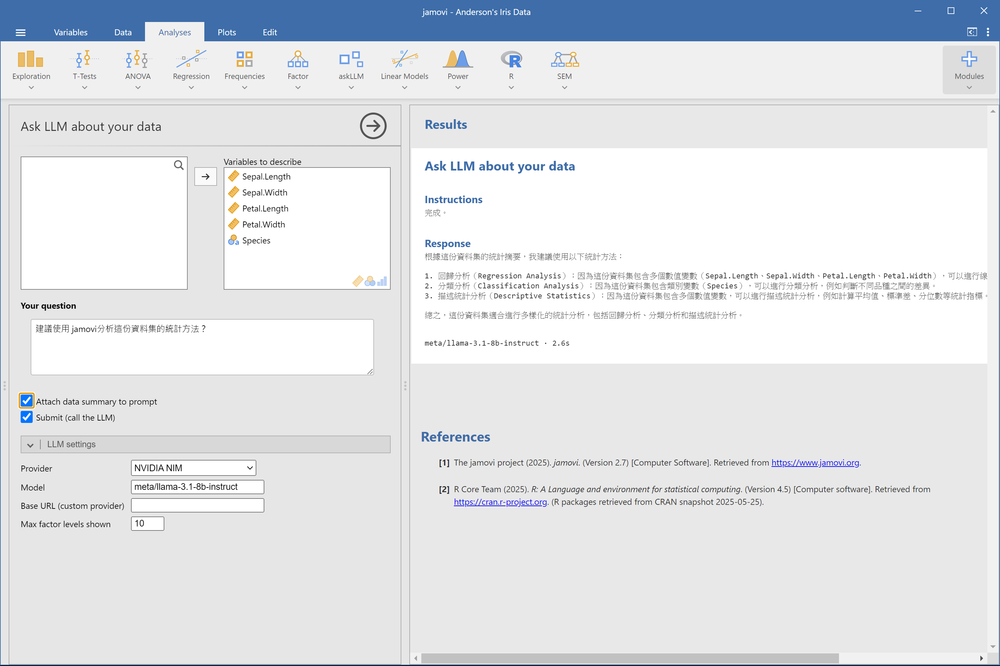
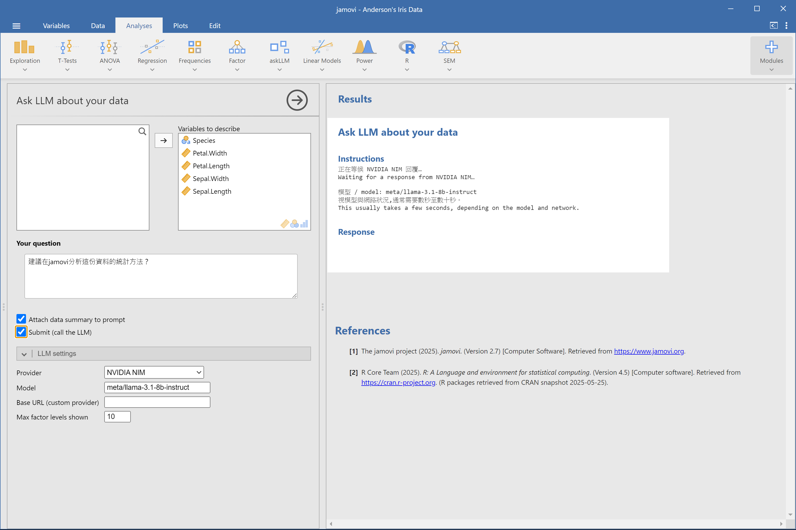
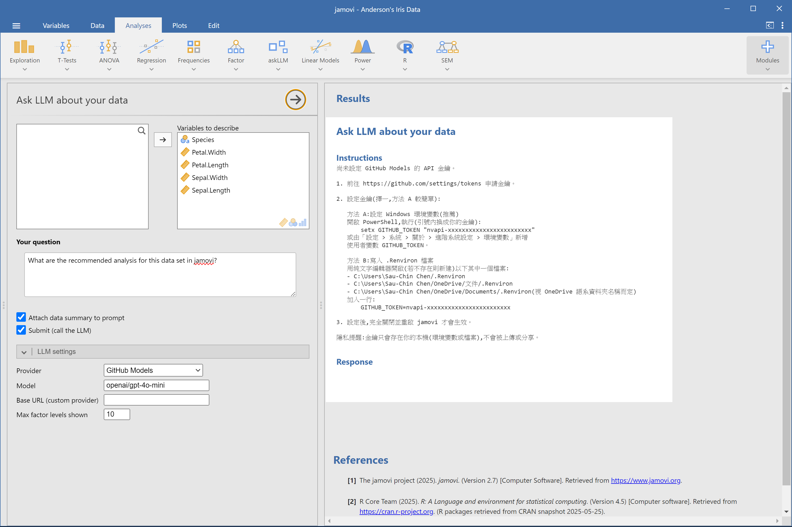

# askLLM

**在 jamovi 裡直接問 LLM 關於「你的資料」的問題。**

勾選你關心的變項,輸入問題(中英文皆可),askLLM 會把這些變項的摘要統計送給你選擇的 LLM,讓它針對你的資料集回答——甚至會給出具體的 jamovi 選單路徑建議。

[English README](README.md)

## 螢幕截圖



<details>
<summary>更多畫面</summary>

**開啟分析時的引導與隱私提醒**


**送出後的等待狀態**



**尚未設定金鑰時的教學畫面(中英雙語)**



</details>

## 安裝方式

### A. 從 jamovi library 安裝(上架後)

開啟 jamovi,點選右上角 `⊕` 圖示 → **jamovi library** → 搜尋「askLLM」→ **Install**。

### B. Side-load `.jmo` 檔案

若尚未上架、或你有本地建置好的 `.jmo` 檔:

1. 在 jamovi 中點選右上角 `⊕` 圖示。
2. 切換到 **Side-load** 分頁。
3. 選擇 `.jmo` 檔(見本 repo 的 [`dist/`](dist/) 目錄)。
4. 等待安裝完成。

注意:`.jmo` 檔綁定特定的**作業系統 × CPU 架構 × jamovi 系列版本**(見檔名,如 `askLLM_1.0.0_win64_jamovi-2.7.jmo`),只能安裝到相符的 jamovi。詳見 [`dist/README.zh-TW.md`](dist/README.zh-TW.md)。

## 快速開始(三步)

1. 在 jamovi 開啟資料集,從分析選單執行 **askLLM**。
2. 勾選要讓 LLM 知道的**變項(Variables to describe)**,並輸入你的**問題**。
3. 勾選 **Submit** 送出。數秒後即可看到回覆,並附上模型名稱與耗時。

修改問題前請先取消勾選 **Submit**,改好再重新勾選——避免每次改動都觸發一次新的(計費)呼叫。

## 支援的 Provider

| Provider | 免費額度 / 免信用卡 | 執行位置 | 設定教學 |
|---|---|---|---|
| NVIDIA NIM | 有,免信用卡 | 雲端 | [SETUP-nim.zh-TW.md](docs/SETUP-nim.zh-TW.md) |
| Google Gemini | 有,免信用卡 | 雲端 | [SETUP-gemini.zh-TW.md](docs/SETUP-gemini.zh-TW.md) |
| GitHub Models | 有(需 GitHub 帳號) | 雲端 | [SETUP-github.zh-TW.md](docs/SETUP-github.zh-TW.md) |
| Ollama(本機) | 完全免費,無需金鑰 | 你的電腦 | [SETUP-ollama.zh-TW.md](docs/SETUP-ollama.zh-TW.md) |
| Custom(自訂端點) | 視端點而定 | 自訂 | [SETUP-custom.zh-TW.md](docs/SETUP-custom.zh-TW.md) |

## 隱私聲明

- 送出給 LLM 的是**你所選變項的摘要統計**(如筆數、平均數、標準差、類別變項各水準次數等),**不是原始資料列**。
- API 金鑰只存於你本機的環境變數或 `.Renviron` 檔案,**不會寫入 `.omv` 檔案**,也不會出現在 jamovi 介面上任何地方。
- 若你需要**完全零資料外送**,請選擇 **Ollama(本機)** 這個 provider——包含 LLM 本身在內,一切都在你自己的電腦上執行。

## 開發者資訊

從原始碼建置並安裝到指定的 jamovi 安裝路徑:

```r
jmvtools::install(home = "C:/Program Files/jamovi 2.7.37.0")
```

執行測試套件(純函式單元測試,以一般系統 R 執行,非 jamovi 內建 R):

```r
devtools::test()
```

## 授權

GPL-3(見 [`DESCRIPTION`](DESCRIPTION))。

## 致謝

- [ellmer](https://ellmer.tidyverse.org/) —— 本模組用來呼叫各家 LLM 的 R 套件。
- [jamovi](https://www.jamovi.org/) —— 本模組所依附的統計平台。
- [jmvtools](https://github.com/jamovi/jmvtools) —— 用來建置與打包本模組的工具鏈。
