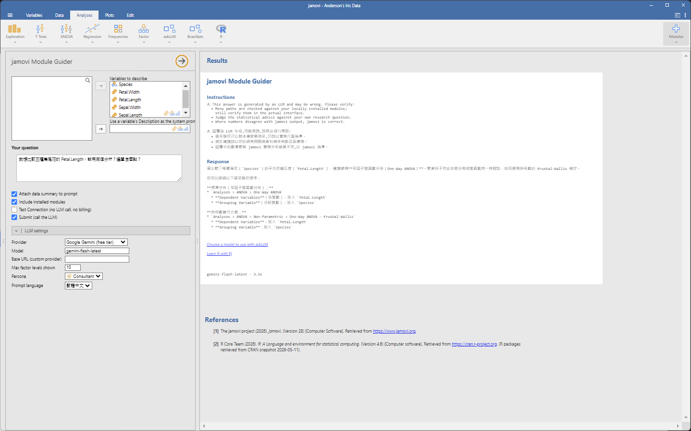
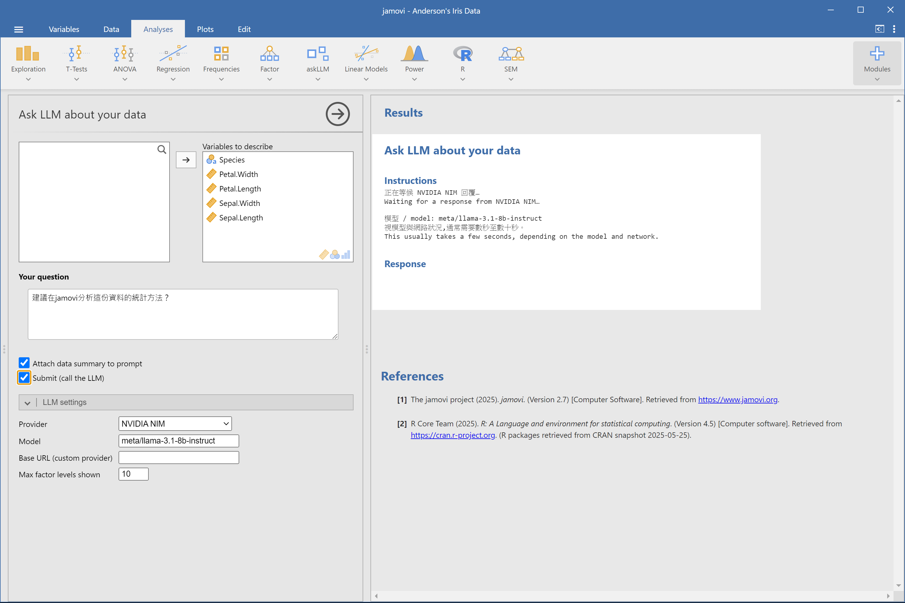
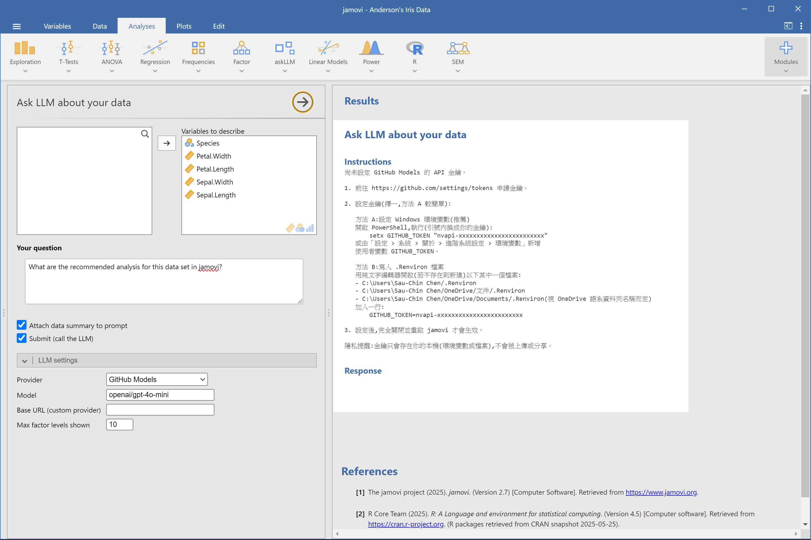

# askLLM

**在 jamovi 裡直接問 LLM 關於「你的資料」的問題。**

勾選你關心的變項,輸入問題(中英文皆可),askLLM 會把這些變項的摘要統計送給你選擇的 LLM,讓它針對你的資料集回答——甚至會給出具體的 jamovi 選單路徑建議。v1.1 新增掃描你實際安裝的 jamovi 模組,把真實選單樹附給 LLM,讓建議只引用真實路徑(實測 18/18 逐字命中)。

[English README](README.md)

## 螢幕截圖



<details>
<summary>更多畫面</summary>

**開啟分析時的引導與隱私提醒**


**送出後的等待狀態**



**尚未設定金鑰時的教學畫面(中英雙語)**



</details>

## 安裝方式

### A. 從 jamovi library 安裝(上架後)

開啟 jamovi,點選右上角 `⊕` 圖示 → **jamovi library** → 搜尋「askLLM」→ **Install**。

### B. Side-load `.jmo` 檔案

若尚未上架、或你有本地建置好的 `.jmo` 檔:

1. 在 jamovi 中點選右上角 `⊕` 圖示。
2. 切換到 **Side-load** 分頁。
3. 選擇 `.jmo` 檔(見本 repo 的 [`dist/`](dist/) 目錄)。
4. 等待安裝完成。

注意:`.jmo` 檔綁定特定的**作業系統 × CPU 架構 × jamovi 系列版本**(見檔名,如 `askLLM_1.1.0_win64_jamovi-2.7.jmo`),只能安裝到相符的 jamovi。詳見 [`dist/README.zh-TW.md`](dist/README.zh-TW.md)。

## 快速開始(三步)

1. 在 jamovi 開啟資料集,從分析選單執行 **askLLM**。
2. 勾選要讓 LLM 知道的**變項(Variables to describe)**,並輸入你的**問題**。
3. 勾選 **Submit** 送出。數秒後即可看到回覆,並附上模型名稱與耗時。

修改問題前請先取消勾選 **Submit**,改好再重新勾選——避免每次改動都觸發一次新的(計費)呼叫。

**Include installed modules**(預設開啟)會自動掃描你的 jamovi 模組並供給 LLM,讓路徑建議精準對應你安裝的分析;取消勾選此選項即回到 v1.0 行為。

**Use a variable's Description as the system prompt**(在「LLM settings」內)可讓你直接用資料集本身驅動人格,不必在模組裡另外輸入:在 jamovi 變數的 Setup 面板中填入該變數的**Description**(如人格設定或任務指示),在此選取該變數,系統即會以它的 Description 作為 system prompt。優先序:該變數的 Description(有選取且非空時)＞**Custom system prompt** 文字框 ＞ Persona 模板。適合已在 codebook 中記錄好各變數情境、想直接讓 LLM 沿用的情境。

## 支援的 Provider

| Provider | 免費額度 / 免信用卡 | 執行位置 | 設定教學 |
|---|---|---|---|
| NVIDIA NIM | 有,免信用卡 | 雲端 | [SETUP-nim.zh-TW.md](docs/SETUP-nim.zh-TW.md) |
| Google Gemini | 有,免信用卡 | 雲端 | [SETUP-gemini.zh-TW.md](docs/SETUP-gemini.zh-TW.md) |
| OpenRouter | 有,免信用卡(`:free` 模型) | 雲端 | [SETUP-openrouter.zh-TW.md](docs/SETUP-openrouter.zh-TW.md) |
| GitHub Models | 有(需 GitHub 帳號) | 雲端 | [SETUP-github.zh-TW.md](docs/SETUP-github.zh-TW.md) |
| Ollama(本機) | 完全免費,無需金鑰 | 你的電腦 | [SETUP-ollama.zh-TW.md](docs/SETUP-ollama.zh-TW.md) |
| Custom(自訂端點) | 視端點而定 | 自訂 | [SETUP-custom.zh-TW.md](docs/SETUP-custom.zh-TW.md) |

只要有 GitHub 帳號就能免費使用 **35 個模型**(OpenAI、Meta Llama、Microsoft Phi、Mistral、DeepSeek、Cohere)——完整清單、免費額度與挑選建議見 **[GitHub Models 模型清單](docs/MODELS-github.zh-TW.md)**。

想比較不同模型回答的準確性與完整性,可用 [`tools/compare-models.R`](tools/compare-models.R):同一份資料與問題連續問多個模型,產出並排報告。

## 限制與使用建議

**LLM 會產生看似合理卻錯誤的內容。** v1.0 實測發現各家模型最常編造的是 **jamovi 選單路徑**(連 jamovi 沒有的選單都寫得很肯定);v1.1 已透過模組目錄掃描大幅緩解此問題(實測命中率 100%, 18/18 零虛構)。統計建議方向則大致合理,其他限制(統計建議適用性、數值查證)仍需自行判斷。

完整的實測記錄與教學建議見 **[限制與使用建議](docs/LIMITATIONS.zh-TW.md)**。

## 隱私聲明

- 送出給 LLM 的是**你所選變項的摘要統計**(如筆數、平均數、標準差、類別變項各水準次數等),**不是原始資料列**。
- API 金鑰只存於你本機的環境變數或 `.Renviron` 檔案,**不會寫入 `.omv` 檔案**,也不會出現在 jamovi 介面上任何地方。
- **已安裝模組的名稱與選單清單**(環境中繼資料,不含資料值)會隨摘要送出供 LLM 參考,用以確保建議的路徑都真實存在;你可用「Include installed modules」選項關閉此功能。
- 若你需要**完全零資料外送**,請選擇 **Ollama(本機)** 這個 provider——包含 LLM 本身在內,一切都在你自己的電腦上執行。

## 隱私設計 vs. 代理式 AI

JASP 0.98(2026-07-02 起)推出「完全整合 AI」,採取代理型設計:把分析結果與輸出本身完整送給 LLM 處理。askLLM 採取不同的資訊架構——諮詢型設計,**僅送摘要統計量,絕不送原始資料列**。兩種設計在面對敏感資料時的隱私風險有本質差異。

### askLLM vs. JASP 0.98 AI 比較

| 面向 | askLLM | JASP 0.98 代理型 AI |
|---|---|---|
| **送給 LLM 的資料** | 所選變項的摘要統計(筆數、平均、標準差、類別頻率等) | 分析結果與完整輸出(含所有細節) |
| **本機執行選項** | Ollama:完全本機,零外送;其他供應商則送雲端 | 僅限 JASP 內部;無完全本機選項 |
| **適用敏感資料情境** | ✓ 支援(尤其搭配 Ollama 本機執行) | ⚠ 需謹慎 |

### 為何敏感資料要特別留意?

**JASP 官方已公開警告**:許多免費 LLM 服務(包括免費層的商業模型)會將用戶輸入用於模型訓練或其他改進目的。這對**病患資料、公司機密、個人敏感資訊**等場景形成風險[^jasp-privacy-warning]。

- 如果你使用代理型 AI 搭配雲端服務,LLM 看到的是**完整的分析結果與統計輸出**,這些資訊經常包含足以識別個體或業務的細節。
- askLLM 的設計則不同:即使採用雲端服務,LLM 也僅看到**摘要統計量**(例如「平均值、標準差、樣本數」),足以建議分析方向,卻不足以重建個別觀測值。搭配 Ollama,你甚至可以**完全絕緣外網**,LLM 與你的資料都在本機運行。

### 建議

- **敏感資料優先使用 Ollama(本機)**:無需 API 金鑰、無外送任何資料。
- **如須使用雲端服務**:askLLM 的「摘要」特性天然降低風險,但建議先以非敏感資料測試、熟悉工具後再用在敏感場景。
- **嚴肅的敏感資料應用(病患、商業機密等)**:請諮詢貴機構的資料保護或隱私團隊,確認政策允許。

---

[^jasp-privacy-warning]: JASP Services BV. (2026). [Set up a Fully Integrated AI in JASP, and Run it for Freeeee](https://www.jasp-services.com/set-up-a-fully-integrated-ai-in-jasp-and-run-it-for-freeeee/); JASP team. (2026). [Free API Key Hunting](https://jasp-stats.org/2026/07/09/free-api-key-hunting/)

## 開發者資訊

從原始碼建置並安裝到指定的 jamovi 安裝路徑:

```r
jmvtools::install(home = "C:/Program Files/jamovi 2.7.37.0")
```

執行測試套件(純函式單元測試,以一般系統 R 執行,非 jamovi 內建 R):

```r
devtools::test()
```

## 授權

GPL-3(見 [`DESCRIPTION`](DESCRIPTION))。

## 致謝

- [ellmer](https://ellmer.tidyverse.org/) —— 本模組用來呼叫各家 LLM 的 R 套件。
- [jamovi](https://www.jamovi.org/) —— 本模組所依附的統計平台。
- [jmvtools](https://github.com/jamovi/jmvtools) —— 用來建置與打包本模組的工具鏈。
